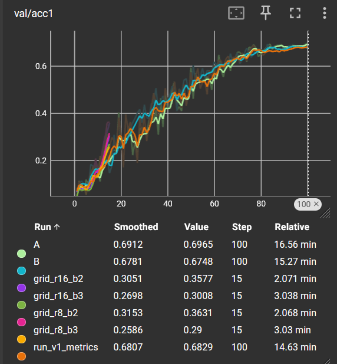

# Oxford-IIIT Pet Classification with SE-CNN

Fine-grained pet breed classification using a custom CNN with Squeeze-and-Excitation attention blocks. Project for CSC8607 — Introduction to Deep Learning.

## Overview

- **Dataset**: Oxford-IIIT Pet (37 cat/dog breeds, ~100 images per class)
- **Model**: PetSE_CNN — 3-stage CNN with SE blocks (~1.2M parameters)
- **Best Results**:
  - Validation: **69.65%** Top-1 Accuracy
  - Test: **57.13%** Top-1 Accuracy, **87.38%** Top-5 Accuracy

## Installation

```bash
# Clone the repository
git clone https://github.com/Wiame-raki/Oxford-IIIT_Pet_Classification.git
cd Oxford-IIIT_Pet_Classification

# Create virtual environment
python -m venv .venv
source .venv/bin/activate  # Linux/Mac
# or: .venv\Scripts\activate  # Windows

# Install dependencies
pip install -r requirements.txt
```

## Usage

All scripts are run as modules from the project root:

```bash
# Training (full run)
python -m src.train --config configs/config.yaml --experiment_name my_run

# Evaluation on test set
python -m src.evaluate --config configs/config.yaml --checkpoint artifacts/best.ckpt

# Learning rate finder
python -m src.lr_finder --config configs/config.yaml

# Grid search (reduction x blocks_per_stage)
python -m src.grid_search --config configs/config.yaml

# Overfit sanity check (1 batch)
python -m src.train --config configs/config.yaml --overfit_batch
```

Or use the Makefile:

```bash
make install      # Install dependencies
make train        # Run training
make eval         # Evaluate best checkpoint
make lr_finder    # Run LR finder
make grid_search  # Run grid search
make clean        # Clean artifacts and runs
```

## Project Structure

```
├── configs/
│   └── config.yaml          # All hyperparameters
├── src/
│   ├── train.py             # Training loop (warmup + cosine annealing)
│   ├── evaluate.py          # Test evaluation
│   ├── model.py             # PetSE_CNN architecture
│   ├── data_loading.py      # Dataset loading + stratified split
│   ├── augmentation.py      # Data augmentation transforms
│   ├── preprocessing.py     # Preprocessing transforms
│   ├── metrics.py           # F1, balanced accuracy, ECE
│   ├── lr_finder.py         # Learning rate range test
│   ├── grid_search.py       # Hyperparameter search
│   └── utils.py             # Utilities (seed, device, config)
├── artifacts/
│   └── best.ckpt            # Best model checkpoint
├── runs/                    # TensorBoard logs
├── report/
│   └── figures/             # Training curves and visualizations
├── report_template.md       # Project report (French)
└── requirements.txt
```

## Model Architecture

```
Input: (B, 3, 128, 128)
    │
    ▼
┌───────────────────────────────────────────────────┐
│ Stage 1: 2x [Conv3x3 -> BN -> ReLU -> SE(64, r)]  │
│          MaxPool2x2 -> (B, 64, 64, 64)            │
├───────────────────────────────────────────────────┤
│ Stage 2: 2x [Conv3x3 -> BN -> ReLU -> SE(128, r)] │
│          MaxPool2x2 -> (B, 128, 32, 32)           │
├───────────────────────────────────────────────────┤
│ Stage 3: 2x [Conv3x3 -> BN -> ReLU -> SE(256, r)] │
│          GAP -> (B, 256)                          │
├───────────────────────────────────────────────────┤
│ Head: Dropout(p) -> Linear(256, 37)               │
└───────────────────────────────────────────────────┘
    │
    ▼
Output: (B, 37) logits
```

**Squeeze-and-Excitation Block**: Channel attention mechanism that learns to reweight feature channels based on their global statistics.

## Configuration

Key hyperparameters in `configs/config.yaml`:

| Parameter | Value | Description |
|-----------|-------|-------------|
| `lr` | 0.002 | Learning rate |
| `weight_decay` | 0.005 | AdamW regularization |
| `epochs` | 100 | Training epochs |
| `batch_size` | 64 | Batch size |
| `reduction` | 8 | SE block reduction ratio |
| `blocks_per_stage` | 2 | Blocks per CNN stage |
| `dropout` | 0.2 | Dropout before classifier |
| `label_smoothing` | 0.1 | Label smoothing factor |

## Results

### Validation (Best Epoch)
| Metric | Value |
|--------|-------|
| Top-1 Accuracy | 69.65% |
| Top-5 Accuracy | 91.60% |
| Macro F1 | 69.56% |
| ECE | 5.40% |

### Test Set
| Metric | Value |
|--------|-------|
| Top-1 Accuracy | 57.13% |
| Top-5 Accuracy | 87.38% |
| Macro F1 | 56.33% |
| ECE | 3.21% |

### Training Curves



## Constraints

This project follows specific course constraints:
- **No transfer learning**: Model trained from scratch
- **Fixed architecture**: PetSE_CNN with SE blocks
- **Input size**: 128x128 pixels
- **Tunable hyperparameters**: Only `reduction` (8 or 16) and `blocks_per_stage` (2 or 3)

## TensorBoard

```bash
tensorboard --logdir runs --port 6006
```

## References

- [Oxford-IIIT Pet Dataset](https://www.robots.ox.ac.uk/~vgg/data/pets/)
- [Squeeze-and-Excitation Networks (Hu et al., 2018)](https://arxiv.org/abs/1709.01507)
- [torchvision.datasets.OxfordIIITPet](https://pytorch.org/vision/stable/generated/torchvision.datasets.OxfordIIITPet.html)

## Author

**RAKI Wiame** — CSC8607 Introduction to Deep Learning
