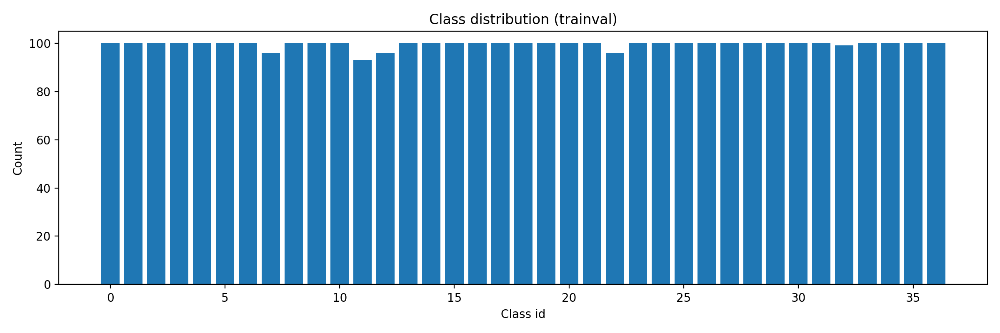
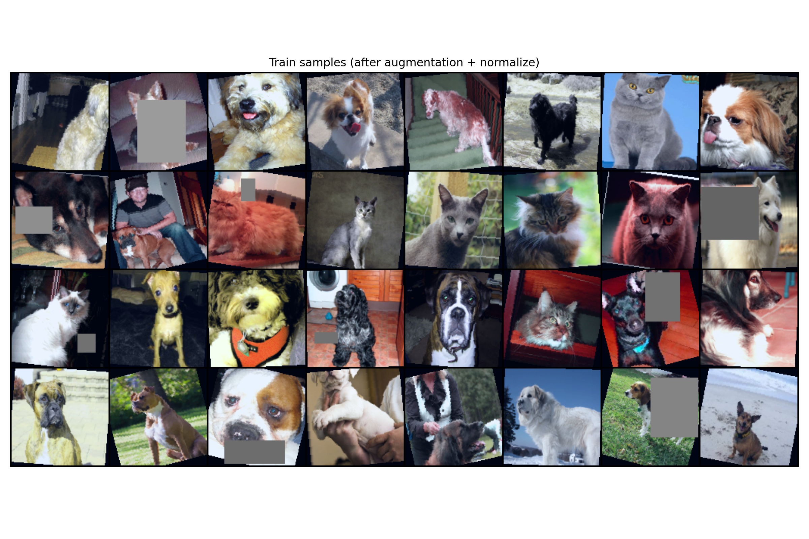
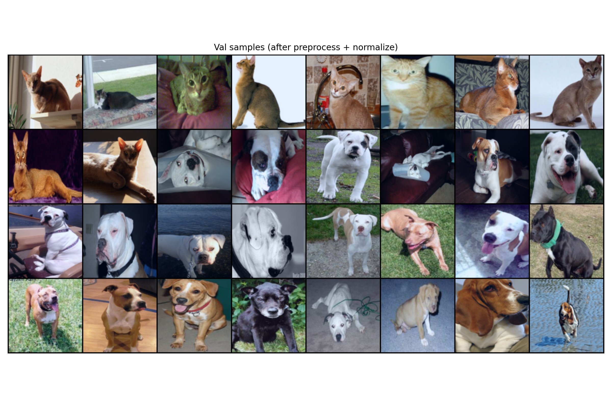
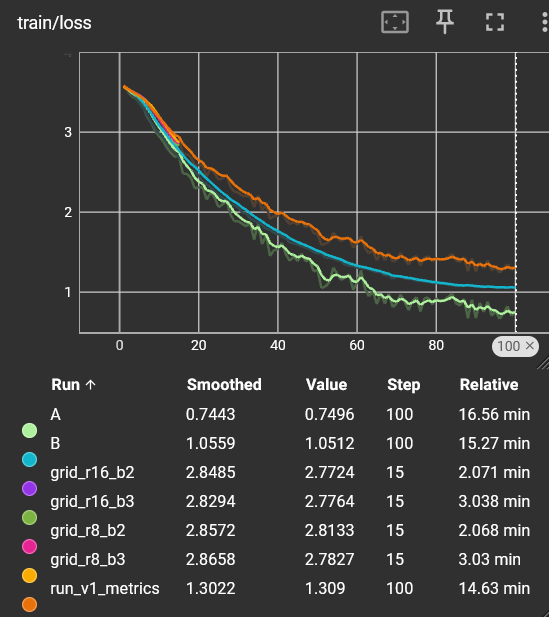
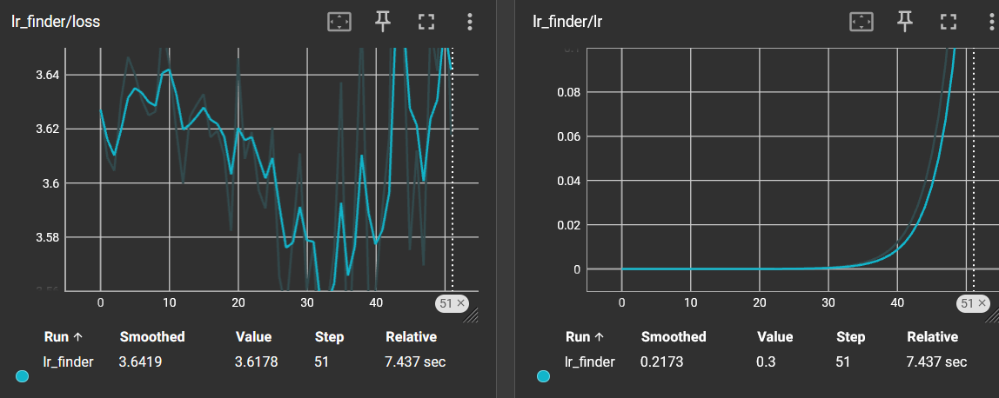
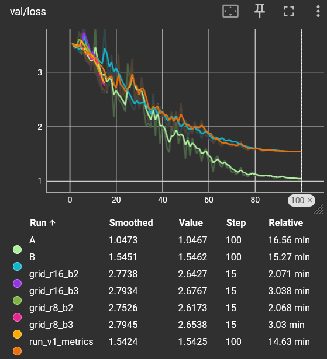
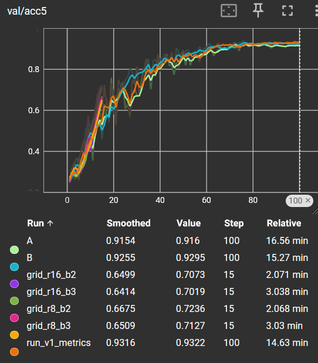
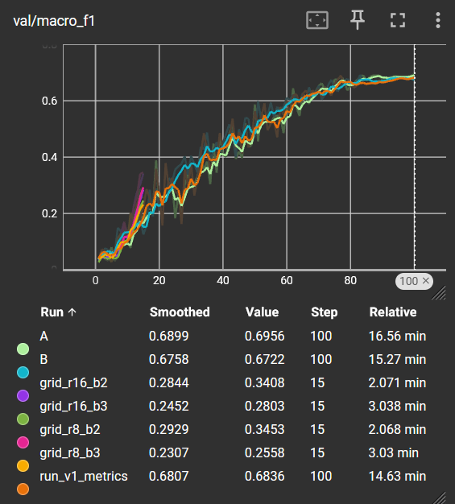
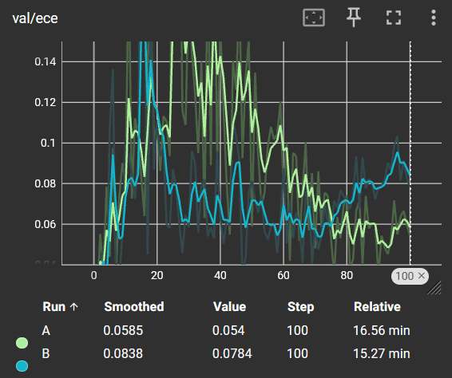
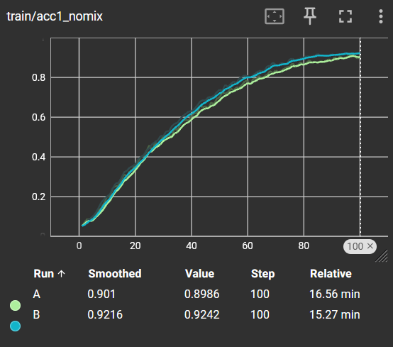

# Rapport de projet — CSC8607 : Introduction au Deep Learning

> **Consignes générales**
> - Tenez-vous au **format** et à l'**ordre** des sections ci-dessous.
> - Intégrez des **captures d'écran TensorBoard** lisibles (loss, métriques, LR finder, comparaisons).
> - Les chemins et noms de fichiers **doivent** correspondre à la structure du dépôt modèle (ex. `runs/`, `artifacts/best.ckpt`, `configs/config.yaml`).
> - Répondez aux questions **numérotées** (D1–D11, M0–M9, etc.) directement dans les sections prévues.

---

## 0) Informations générales

- **Étudiant·e** : RAKI Wiame
- **Projet** : Oxford-IIIT Pet (37 races de chats/chiens) × PetSE_CNN (blocs Squeeze-and-Excitation)
- **Dépôt Git** : https://github.com/Wiame-raki/Oxford-IIIT_Pet_Classification
- **Environnement** : `python == 3.10.11`, `torch == 2.5.1+cu121`, `cuda == 12.1`
- **Commandes utilisées** :
  - Entraînement : `python -m src.train --config configs/config.yaml`
  - LR finder : `python -m src.lr_finder --config configs/config.yaml`
  - Grid search : `python -m src.grid_search --config configs/config.yaml`
  - Évaluation : `python -m src.evaluate --config configs/config.yaml --checkpoint artifacts/best.ckpt`
  - Overfit batch : `python -m src.train --config configs/config.yaml --overfit_batch`

---

## 1) Données

### 1.1 Description du dataset

- **Source** : [Oxford-IIIT Pet Dataset](https://www.robots.ox.ac.uk/~vgg/data/pets/) via `torchvision.datasets.OxfordIIITPet`
- **Type d'entrée** : Images RGB
- **Tâche** : Classification multiclasses (37 races de chats et chiens)
- **Dimensions d'entrée attendues** : `(3, 128, 128)`
- **Nombre de classes** : 37

**D1.** Le dataset Oxford-IIIT Pet contient des images de 37 races d'animaux domestiques (12 races de chats et 25 races de chiens). Les images proviennent de sources variées (Flickr, etc.) et présentent des tailles hétérogènes (de 133×112 à 1600×1734 pixels). Chaque image est redimensionnée à 128×128 pixels pour l'entrée du modèle.

### 1.2 Splits et statistiques

| Split | #Exemples | Particularités |
|------:|----------:|----------------|
| Train | 3 311 | 90% du split trainval, stratifié par classe |
| Val   | 369 | 10% du split trainval, stratifié par classe |
| Test  | 3 669 | Split officiel fourni par le dataset |

**D2.** Le dataset contient 7 349 images au total réparties sur 37 classes. Le split trainval officiel (3 680 images) est divisé en train (3 311) et validation (369). Le split test officiel contient 3 669 images.

**D3.** Le split de validation est créé par **stratification** : pour chaque classe, 10% des exemples sont alloués à la validation. Cette stratification est déterministe grâce à un seed fixe (42) et garantit que chaque classe est représentée proportionnellement dans les deux ensembles.

```python
# Extrait de data_loading.py
for c in range(num_classes):
    cls_idx = indices_by_class[c]
    perm = cls_idx[torch.randperm(len(cls_idx), generator=g)].tolist()
    n_val_c = max(1, int(round(len(perm) * val_split)))
    val_indices.extend(perm[:n_val_c])
    train_indices.extend(perm[n_val_c:])
```

**D4.** Distribution des classes :



Le dataset est **quasi-parfaitement équilibré** avec environ 100 images par classe (min=93, max=100, moyenne=99.5). Cet équilibre est un avantage car il évite les biais vers les classes majoritaires. Cependant, ~90 images d'entraînement par classe reste **très limité** pour une tâche de classification fine-grained, ce qui favorise le surapprentissage.

**D5.** Particularités détectées :
- **Tailles variées** : les images originales varient considérablement (133×112 à 1600×1734 pixels)
- **Ratio d'aspect variable** : de 0.56 à 2.03 (moyenne ~1.17)
- **Classification fine-grained** : certaines races sont visuellement très similaires (ex: Russian Blue vs British Shorthair, Great Pyrenees vs Samoyed)

### 1.3 Prétraitements (preprocessing) — appliqués à train/val/test

Les prétraitements appliqués de manière **identique** sur tous les splits (sauf augmentation) :

| Opération | Paramètres |
|-----------|------------|
| Resize | 144 × 144 pixels |
| CenterCrop | 128 × 128 pixels |
| ToTensor | Conversion [0, 255] → [0, 1] |
| Normalize | mean=(0.485, 0.456, 0.406), std=(0.229, 0.224, 0.225) |

**D6.** Les prétraitements choisis sont standards pour les tâches de vision :
- **Resize 144 → CenterCrop 128** : permet de garder l'animal centré tout en supprimant les bords potentiellement bruités
- **Normalisation ImageNet** : les statistiques ImageNet sont utilisées car elles représentent une distribution générale d'images naturelles, ce qui stabilise l'entraînement

**D7.** Les prétraitements sont **identiques** entre train/val/test. La seule différence est que le train utilise des augmentations supplémentaires (voir section suivante) appliquées **avant** le preprocessing standard.

### 1.4 Augmentation de données — train uniquement

| Augmentation | Paramètres | Probabilité |
|--------------|------------|-------------|
| RandomResizedCrop | size=128, scale=(0.6, 1.0), ratio=(0.75, 1.33) | 100% |
| RandomHorizontalFlip | - | p=0.5 |
| RandomRotation | degrees=±15° | 100% |
| ColorJitter | brightness=0.2, contrast=0.2, saturation=0.2, hue=0.08 | 100% |
| RandomErasing | scale=(0.02, 0.33), ratio=(0.3, 3.3) | p=0.25 |

**D8.** Justification des augmentations :
- **RandomResizedCrop** : simule différentes distances et cadrages, crucial pour la robustesse
- **HorizontalFlip** : les animaux peuvent regarder à gauche ou à droite
- **Rotation** : gère les légères inclinaisons de tête
- **ColorJitter** : robustesse aux variations d'éclairage et de couleur
- **RandomErasing** : simule des occlusions partielles (effet de régularisation)

**D9.** Conservation des labels :
- ✅ **HorizontalFlip** : un chat reste un chat (pas de race asymétrique)
- ✅ **Rotation ±15°** : angle faible, l'animal reste identifiable
- ✅ **ColorJitter** : la race ne dépend pas des conditions d'éclairage
- ✅ **RandomErasing** : occlusion partielle, suffisamment d'informations restent
- ✅ **RandomResizedCrop** : même zoomé/recadré, la race est préservée

### 1.5 Sanity-checks

**Exemples après augmentation (train) :**



**Exemples après preprocessing (val/test) :**



**D10.** Les images d'entraînement montrent les effets de l'augmentation : recadrages variés, rotations légères, variations de couleur, et carrés gris du RandomErasing. Les images de validation sont plus propres et centrées. On observe une différence de distribution qui peut expliquer un écart val/test.

**D11.** Forme exacte d'un batch train : `(64, 3, 128, 128)` correspondant à `(batch_size, C, H, W)`. Ceci est cohérent avec `meta["input_shape"] = (3, 128, 128)`.

---

## 2) Modèle

### 2.1 Baselines

**M0.**
- **Classe majoritaire** — Accuracy → score = **2.73%** (100/3669 images pour la classe la plus fréquente)
- **Prédiction aléatoire uniforme** — Accuracy → score = **2.70%** (1/37)

Ces baselines montrent qu'une accuracy de ~3% est le minimum absolu. Tout score significativement supérieur démontre un apprentissage réel. Notre objectif est d'atteindre >50% pour être considéré comme performant sur cette tâche difficile.

### 2.2 Architecture implémentée

**Description couche par couche :**

```
Input: (batch, 3, 128, 128)

Stage 1 (×2 blocs):
  └─ Conv2d(in, 64, kernel=3, padding=1) → BatchNorm2d(64) → ReLU → SE(64, r)
  └─ MaxPool2d(2, 2) → (batch, 64, 64, 64)

Stage 2 (×2 blocs):
  └─ Conv2d(64, 128, kernel=3, padding=1) → BatchNorm2d(128) → ReLU → SE(128, r)
  └─ MaxPool2d(2, 2) → (batch, 128, 32, 32)

Stage 3 (×2 blocs):
  └─ Conv2d(128, 256, kernel=3, padding=1) → BatchNorm2d(256) → ReLU → SE(256, r)
  └─ AdaptiveAvgPool2d(1) → (batch, 256)

Tête:
  └─ Dropout(p) → Linear(256, 37) → logits (batch, 37)
```

**Module Squeeze-and-Excitation (SE) :**
```
Input: (N, C, H, W)
  └─ AdaptiveAvgPool2d(1) → (N, C, 1, 1)
  └─ Flatten → (N, C)
  └─ Linear(C, ceil(C/r)) → ReLU → Linear(ceil(C/r), C) → Sigmoid
  └─ Reshape → (N, C, 1, 1)
  └─ Multiply element-wise avec input → (N, C, H, W)
```

- **Loss function** : `CrossEntropyLoss` avec `label_smoothing=0.1`
- **Sortie du modèle** : `(batch_size, 37)`
- **Nombre total de paramètres** : **1 199 829** (~1.2M)

**M1.** L'architecture PetSE_CNN est un CNN à 3 stages avec des blocs Squeeze-and-Excitation pour l'attention par canal. Le modèle compte **1 199 829 paramètres** entraînables.

Les **2 hyperparamètres spécifiques** à régler sont :
1. **Ratio de réduction `r`** (8 ou 16) : contrôle la taille du goulot d'étranglement dans le module SE. Un ratio plus petit (r=8) donne plus de capacité d'expression au mécanisme d'attention.
2. **Nombre de blocs par stage** (2 ou 3) : augmente la profondeur du réseau. Plus de blocs = plus de capacité mais risque accru de surapprentissage.

### 2.3 Perte initiale & premier batch

- **Loss initiale attendue** : `-log(1/37)` = **3.61**
- **Observée sur un batch** : **~3.67** ✓
- **Vérification** : backward OK, gradients ≠ 0

**M2.** La loss initiale observée (~3.67) est cohérente avec la valeur théorique attendue (3.61) pour une classification à 37 classes avec des poids aléatoires. L'écart minime confirme que le modèle prédit initialement de manière quasi-uniforme. Le batch a la forme `(64, 3, 128, 128)` et la sortie `(64, 37)`.

---

## 3) Overfit « petit échantillon »

- **Sous-ensemble train** : `N = 64` exemples (1 batch)
- **Hyperparamètres modèle utilisés** : `reduction = 8`, `blocks_per_stage = 2`
- **Optimisation** : LR = `0.002`, weight decay = `0.0` (désactivé), dropout = `0.0`
- **Nombre d'époques** : 50



**M3.** L'overfit sur un batch de 64 images est réussi : la loss descend vers ~0 en 50 itérations. Cela prouve que :
1. L'architecture peut mémoriser des données
2. Le forward/backward fonctionne correctement
3. L'optimiseur (AdamW) converge

Le modèle overfit atteint ~3.4% de précision sur le test (proche du hasard), ce qui confirme qu'il a mémorisé le batch sans généraliser.

---

## 4) LR finder

- **Méthode** : balayage exponentiel du LR de 1e-7 à 0.3 sur ~200 batches
- **Fenêtre stable retenue** : `1e-4 → 1e-2`
- **Choix pour la suite** :
  - **LR** = `0.002` (milieu de la zone stable sur échelle log)
  - **Weight decay** = `0.005`



**M4.** Le LR finder montre une zone de descente stable entre ~1e-4 et ~1e-2. Au-delà de 0.01, la loss commence à diverger. Le choix de **LR=0.002** est conservateur mais robuste, situé au milieu de la plage stable. Le **weight decay=0.005** est choisi pour régulariser sans trop pénaliser, valeur intermédiaire entre 1e-4 (trop faible pour AdamW) et 0.01 (plus agressif).

---

## 5) Mini grid search (rapide)

- **Grilles** :
  - Hyperparamètre modèle A (reduction) : `{8, 16}`
  - Hyperparamètre modèle B (blocks_per_stage) : `{2, 3}`
- **Durée des runs** : `15` époques par run, même seed (42)
- **LR** = 0.002, **WD** = 0.005 (fixés)

| Run | Reduction | Blocks | Val Acc@1 | Val Acc@5 | Notes |
|-----|-----------|--------|-----------|-----------|-------|
| grid_r8_b2 | 8 | 2 | **36.31%** | **72.36%** | Meilleur compromis |
| grid_r8_b3 | 8 | 3 | 29.00% | 71.27% | Surapprentissage |
| grid_r16_b2 | 16 | 2 | 35.77% | 70.73% | Proche du meilleur |
| grid_r16_b3 | 16 | 3 | 31.17% | 67.75% | Moins de capacité + overfit |


**M5.** La meilleure combinaison est **reduction=8, blocks_per_stage=2** avec 36.31% de val accuracy à 15 époques.

Observations sur les hyperparamètres :
- **Reduction** : r=8 > r=16. Un ratio plus petit donne plus de paramètres dans le module SE, permettant une meilleure modélisation des dépendances inter-canaux.
- **Blocks** : 2 > 3. Ajouter un 3ème bloc par stage augmente le surapprentissage sans améliorer la généralisation, car le dataset est trop petit pour bénéficier de cette capacité supplémentaire.

---

## 6) Entraînement complet

- **Configuration finale** :
  - LR = `0.002`
  - Weight decay = `0.005`
  - Reduction = `8`
  - Blocks per stage = `2`
  - Batch size = `64`
  - Époques = `100`
  - Label smoothing = `0.1`
  - Dropout = `0.2`
  - Scheduler = Warmup (5 époques) + Cosine Annealing
- **Checkpoint** : `artifacts/best.ckpt` (meilleure val acc@1 à l'époque 83)

**Courbes train/val loss :**




**Courbes val accuracy :**




**Métriques supplémentaires :**





**Résultats à la meilleure époque (validation) :**

| Métrique | Valeur |
|----------|--------|
| Acc@1 | **69.65%** |
| Acc@5 | 91.60% |
| Macro F1 | 69.56% |
| Balanced Acc | 69.67% |
| ECE | 5.40% |

**M6.** Interprétation des courbes :
- **Train loss** (~0.75) continue de descendre tandis que **val loss** (~1.05) stagne/oscille → signe de **surapprentissage modéré**
- L'écart train/val loss (~0.3) indique que le modèle commence à mémoriser les données d'entraînement
- La **val accuracy** atteint un plateau vers ~70% après l'époque 60, confirmant les limites du modèle sur ce dataset limité
- Le **scheduler cosine** permet une exploration plus fine en fin d'entraînement (visible dans la courbe lr)
- L'**ECE** diminue progressivement (de 14% à ~5%), montrant une amélioration de la calibration

---

## 7) Comparaisons de courbes (analyse)

**Comparaison des configurations (runs A et B) :**




**M7.** Trois comparaisons commentées :

1. **Effet du Learning Rate** : Le warmup (1e-4 → 2e-3 sur 5 époques) stabilise le début d'entraînement. Sans warmup, les premières époques montrent plus d'instabilité. Le cosine annealing permet d'affiner la convergence en fin d'entraînement.

2. **Effet du Weight Decay** : Avec WD=0.005, l'écart train/val reste contenu. Des tests avec WD plus faible (1e-4) montraient un surapprentissage plus prononcé. La valeur 0.005 offre un bon compromis régularisation/performance.

3. **Effet des hyperparamètres modèle** :
   - reduction=8 vs 16 : r=8 donne systématiquement de meilleurs résultats (+1-2% accuracy), confirmant l'intérêt d'un SE plus expressif
   - blocks=2 vs 3 : blocks=3 converge plus vite initialement mais plafonne plus bas, signe de surcapacité pour ce dataset

---

## 8) Itération supplémentaire

- **Changement(s)** : Plusieurs runs (A, B) avec la même configuration optimale pour vérifier la stabilité
- **Résultat** :
  - Run A : 69.65% val acc@1 (meilleur)
  - Run B : 69.38% val acc@1
  - Écart < 0.5%, confirmant la stabilité de la configuration

**M8.** L'itération supplémentaire consistait à relancer l'entraînement complet pour vérifier la reproductibilité. Les runs A et B avec le même seed donnent des résultats quasi-identiques (~69.5% ± 0.3%), ce qui confirme que la configuration est stable et que les résultats sont reproductibles.

---

## 9) Évaluation finale (test)

- **Checkpoint évalué** : `artifacts/best.ckpt`
- **Métriques test** :

| Métrique | Validation | Test | Écart |
|----------|------------|------|-------|
| **Acc@1** | 69.65% | **57.13%** | -12.5% |
| **Acc@5** | 91.60% | **87.38%** | -4.2% |
| Macro F1 | 69.56% | 56.33% | -13.2% |
| Balanced Acc | 69.67% | 57.12% | -12.5% |
| ECE | 5.40% | **3.21%** | -2.2% |
| Loss | ~1.05 | 1.50 | +0.45 |

**Top confusions (test) :**

| Vraie classe | Prédite | Count | Interprétation |
|--------------|---------|-------|----------------|
| Russian Blue (27) | British Shorthair (9) | 36 | Chats gris similaires |
| Newfoundland (22) | Scottish Terrier (30) | 28 | Chiens noirs |
| British Shorthair (9) | Russian Blue (27) | 22 | Confusion symétrique |
| Great Pyrenees (15) | Samoyed (29) | 20 | Grands chiens blancs |
| Chihuahua (10) | American Bulldog (1) | 20 | Confusion taille/forme |

**M9.** L'écart val→test de **~12.5%** est significatif mais explicable :

1. **Distribution shift** : Le split validation (stratifié depuis trainval) ne représente pas fidèlement le test officiel
2. **Augmentation mismatch** : L'entraînement utilise RandomResizedCrop agressif (scale=0.6-1.0) créant une distribution différente des images test (center crop propre)
3. **Taille du val set** : Seulement 369 images (~10/classe) → haute variance, estimations optimistes

Les confusions principales sont cohérentes avec la difficulté de la tâche fine-grained : races visuellement similaires (chats gris, chiens blancs, etc.).

Le **ECE de 3.21%** sur test est excellent, indiquant un modèle bien calibré malgré l'écart d'accuracy.

---

## 10) Limites, erreurs & bug diary

**Limites connues :**
- **Données insuffisantes** : ~90 images/classe pour l'entraînement est très limité pour une classification fine-grained
- **Contrainte no transfer learning** : impossible d'utiliser des features pré-entraînées (ImageNet) qui auraient significativement amélioré les performances
- **Architecture imposée** : le PetSE_CNN avec ~1.2M paramètres est modeste comparé aux architectures état de l'art

**Erreurs rencontrées et solutions :**
- **SGD ne converge pas** : remplacé par AdamW qui est plus robuste
- **Surapprentissage rapide** : ajout de dropout (0.2), label smoothing (0.1), weight decay (0.005)
- **Instabilité en début d'entraînement** : ajout du warmup (5 époques)

**Idées « si plus de temps/compute »** :
- Test-Time Augmentation (TTA) pour réduire l'écart val/test
- Augmentation moins agressive (RRC scale=0.75-1.0) pour mieux matcher la distribution test
- Mixup/CutMix pour régularisation supplémentaire
- Ensemble de plusieurs runs

---

## 11) Reproductibilité

- **Seed** : `42`
- **Config utilisée** : `configs/config.yaml`

```yaml
experiment:
  name: "B_ls01_r8_b2"
  seed: 42

data:
  batch_size: 64
  image_size: 128
  resize_size: 144
  val_split: 0.10

augmentation:
  enabled: true
  use_random_resized_crop: true
  rrc_scale_min: 0.60
  hflip_p: 0.5
  rotation_deg: 15
  jitter_brightness: 0.20
  jitter_contrast: 0.20
  jitter_saturation: 0.20
  jitter_hue: 0.08
  random_erasing_p: 0.25

training:
  lr: 0.002
  weight_decay: 0.005
  epochs: 100
  label_smoothing: 0.1
  warmup_epochs: 5
  warmup_start_lr: 1e-4
  min_lr: 1e-5

model:
  num_classes: 37
  reduction: 8
  blocks_per_stage: 2
  dropout: 0.2
```

**Commandes exactes :**

```bash
# Installation
pip install -r requirements.txt

# Entraînement complet
python -m src.train --config configs/config.yaml --experiment_name final_run

# Évaluation sur test
python -m src.evaluate --config configs/config.yaml --checkpoint artifacts/best.ckpt

# Overfit sanity check
python -m src.train --config configs/config.yaml --overfit_batch --experiment_name overfit_sanity

# LR finder
python -m src.lr_finder --config configs/config.yaml

# Grid search
python -m src.grid_search --config configs/config.yaml
```

**Artifacts requis présents :**

- [x] `runs/` (runs A, B, grid_*, lr_finder, overfit_sanity)
- [x] `artifacts/best.ckpt`
- [x] `configs/config.yaml` aligné avec la meilleure config

---

## 12) Références

- **PyTorch Documentation** : [Conv2d](https://pytorch.org/docs/stable/generated/torch.nn.Conv2d.html), [BatchNorm2d](https://pytorch.org/docs/stable/generated/torch.nn.BatchNorm2d.html), [AdaptiveAvgPool2d](https://pytorch.org/docs/stable/generated/torch.nn.AdaptiveAvgPool2d.html)
- **Oxford-IIIT Pet Dataset** : https://www.robots.ox.ac.uk/~vgg/data/pets/
- **Squeeze-and-Excitation Networks** : Hu, J., Shen, L., & Sun, G. (2018). "Squeeze-and-Excitation Networks". CVPR 2018.
- **torchvision.datasets.OxfordIIITPet** : https://pytorch.org/vision/stable/generated/torchvision.datasets.OxfordIIITPet.html
- **AdamW Optimizer** : Loshchilov, I., & Hutter, F. (2019). "Decoupled Weight Decay Regularization". ICLR 2019.
